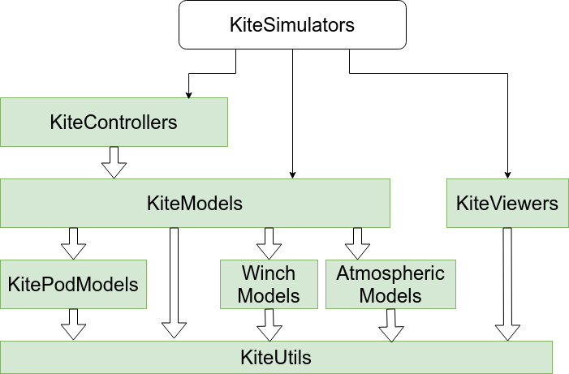

# KiteModels

[](https://ufechner7.github.io/KiteModels.jl/stable)
[](https://ufechner7.github.io/KiteModels.jl/dev)
[](https://github.com/ufechner7/KiteModels.jl/actions/workflows/CI.yml)
[](https://codecov.io/gh/ufechner7/KiteModels.jl)

## Kite power system models, consisting of tether and kite
The model has the following subcomponents, implemented in separate packages:
- AtmosphericModel from [AtmosphericModels](https://github.com/aenarete/AtmosphericModels.jl)
- WinchModel from [WinchModels](https://github.com/aenarete/WinchModels.jl) 
- KitePodModel from  [KitePodModels](https://github.com/aenarete/KitePodModels.jl)

This package is part of Julia Kite Power Tools, which consists of the following packages:
<p align="center"></p>

## News
#### August 2024
- a new kite model, KPS3_3L was contributed. It uses three lines to the ground and three winches for steering a ram-air foil kite.
- a new KCU model was added which assumes a linear relationship between the depower settings and the depower angle and thus is easier to configure than the original model.
#### July 2024
- a new groundstation / winch type is now supported, the `TorqueControlledMachine`. It can be configured in the section `winch` of the `settings.yaml` file. It uses a set torque as input.
- a Python interface is now provided, see: [pykitemodels](https://github.com/ufechner7/pykitemodels)
#### April 2024
- added support for the native Julia DAE solver DFBDF. It is much more accurate and faster than the IDA solver that was used before.

## What to install
If you want to run simulations and see the results in 3D, please install the meta package  [KiteSimulators](https://github.com/aenarete/KiteSimulators.jl) . If you are not interested in 3D visualization or control you can just install this package.

## Installation
Install [Julia 1.10](https://ufechner7.github.io/2024/08/09/installing-julia-with-juliaup.html) or later, if you haven't already. 

Before installing this software it is suggested to create a new project, for example like this:
```bash
mkdir test
cd test
julia --project="."
```
Then add KiteModels from  Julia's package manager, by typing:
```julia
using Pkg
pkg"add KiteModels"
``` 
at the Julia prompt. You can run the unit tests with the command:
```julia
pkg"test KiteModels"
```
You can copy the examples to your project with:
```
copy_settings()
copy_examples()
```

## Advanced installation
If you intend to modify or extend the code, it is suggested to fork the `KiteModels.jl` repository and to check out your fork:
```bash
git clone https://github.com/USERNAME/KiteModels.jl
```
where USERNAME is your github username.
The compile a system image:
```bash
cd KiteModels.jl/bin
./create_sys_image --update
```
If you know launch julia with:
```bash
cd ..
./bin/run_julia
```
you can run the examples with
```julia
include("example/menu.jl")
```

## One point model
This model assumes the kite to be a point mass. This is sufficient to model the aerodynamic forces, but the dynamic concerning the turning action of the kite is not realistic.
When combined with a controller for the turn rate it can be used to simulate a pumping kite power system with medium accuracy.

## Four point model
This model assumes the kite to consist of four-point masses with aerodynamic forces acting on points B, C and D. It reacts much more realistically than the one-point model because it has rotational inertia in every axis.
<p align="center"></p>

## Tether
The tether is modeled as point masses, connected by spring-damper elements. Aerodynamic drag is modeled realistically. When reeling out or in the unstreched length of the spring-damper elements
is varied. This does not translate into physics directly, but it avoids adding point masses at run-time, which would be even worse because it would introduce discontinuities. When using
Dyneema or similar high strength materials for the tether the resulting system is very stiff which is a challenge for the solver.

## Further reading
These models are described in detail in [Dynamic Model of a Pumping Kite Power System](http://arxiv.org/abs/1406.6218).

## Replaying log files
If you want to replay old flight log files in 2D and 3D to understand and explain better how kite power systems work, please have a look at [KiteViewer](https://github.com/ufechner7/KiteViewer) . How new log files can be created and replayed is explained in the documentation of [KiteSimulators](https://github.com/aenarete/KiteSimulators.jl) .

## Licence
This project is licensed under the MIT License. Please see the below WAIVER in association with the license.

## WAIVER
Technische Universiteit Delft hereby disclaims all copyright interest in the package “KiteModels.jl” (models for airborne wind energy systems) written by the Author(s).

Prof.dr. H.G.C. (Henri) Werij, Dean of Aerospace Engineering

## Donations
If you like this software, please consider donating to [Flood in Kenya](https://www.climatejusticesolidarity.nl/solidarity/) .

## See also
- [Research Fechner](https://research.tudelft.nl/en/publications/?search=Fechner+wind&pageSize=50&ordering=rating&descending=true) for the scientic background of this code
- The meta-package  [KiteSimulators](https://github.com/aenarete/KiteSimulators.jl)
- the package [KiteUtils](https://github.com/ufechner7/KiteUtils.jl)
- the packages [WinchModels](https://github.com/aenarete/WinchModels.jl) and [KitePodModels](https://github.com/aenarete/KitePodModels.jl) and [AtmosphericModels](https://github.com/aenarete/AtmosphericModels.jl)
- the packages [KiteControllers](https://github.com/aenarete/KiteControllers.jl) and [KiteViewers](https://github.com/aenarete/KiteViewers.jl)

**Documentation** [Stable Version](https://ufechner7.github.io/KiteModels.jl/stable) --- [Development Version](https://ufechner7.github.io/KiteModels.jl/dev)


Author: Uwe Fechner (uwe.fechner.msc@gmail.com), Bart van de Lint
