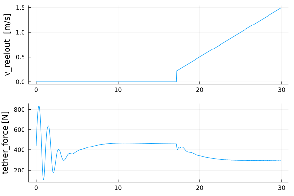

```@meta
CurrentModule = KiteModels
```
# Examples for using the four point kite model

## Create a test project
```bash
mkdir test
cd test
julia --project=.
```
Don't forget to type the dot at the end of the last line.
With the last command, we told Julia to create a new project in the current directory.

You can copy the examples to your project with:
```julia
using KiteModels
KiteModels.install_examples()
```

## Plotting the initial state
First, an instance of the model of the kite control unit (KCU) is created which is needed by the Kite Power System model KPS3. Then we create a kps instance, passing the kcu model as parameter. We need to declare these variables as const to achieve a decent performance.
```julia
using KiteModels
kcu::KCU = KCU(se())
kps = KPS4(kcu)
```
Then we call the function `find_steady_state` which uses a non-linear solver to find the solution for a given elevation angle, reel-out speed and wind speed. 
```julia
find_steady_state!(kps, prn=true)
```
Finding the steady state of the 4-point model is difficult and it only works when we artificially reduce the stiffness by a factor
of 0.035. In the function [`init!`](@ref) this factor is slowly increased to 1.0.

To plot the result in 2D we extract the vectors of the x and z coordinates of the tether particles with a for loop:
```julia
x = Float64[] 
z = Float64[]
for i in 1:length(kps.pos)
     push!(x, kps.pos[i][1])
     push!(z, kps.pos[i][3])
end
```
And finally, we plot the position of the particles in the x-z plane. When you type ```using ControlPlots``` you will be asked if you want to install the ControlPlots package. Just press \<ENTER\> and it gets installed.
```julia
using ControlPlots
plot(x,z, xlabel="x [m]", ylabel="z [m]", scatter=true)
```
### Initial State


## Print other model outputs
Print the vector of the positions of the particles:
```
julia> kps.pos
11-element StaticArrays.SVector{11, StaticArrays.MVector{3, Float64}} with indices SOneTo(11):
 [0.0, 0.0, 0.0]
 [9.179237622840555, 0.0, 23.842235605018427]
 [18.04995989861643, 0.0, 47.800963572571995]
 [26.562156210544767, 0.0, 71.88939923189402]
 [34.68610302268368, 0.0, 96.11152960655927]
 [42.39897331360162, 0.0, 120.4676716318371]
 [49.681585065247006, 0.0, 144.95590371155842]
 [50.19560621291923, 0.0, 150.01396766608025]
 [51.447158096922415, 0.0, 152.22064860101747]
 [51.269841233250816, 2.823293379900761, 149.7849943282592]
 [51.269841233250816, -2.823293379900761, 149.7849943282592]

```
Print the unstretched and stretched tether length and the height of the kite:
```julia
julia> unstretched_length(kps)
150.0

julia> tether_length(kps)
152.24467154884996

julia> calc_height(kps)
152.18828499538841
```
Because of the the stiffness_factor of 0.035 we have a longer tether-length then when using
the 1 point kite model. 

Print the force at the winch (groundstation, in Newton) and at each tether segment:
```julia
julia> winch_force(kps)
321.91887139903304

julia> spring_forces(kps)
15-element Vector{Float64}:
 321.90741146969305
 321.90394881639793
 321.90117644298266
 321.8991487686265
 321.89747937647513
 321.8960226182887
  48.63781489453856
 -44.13400039648584
 -38.834017666472626
 128.20126839800218
 149.28336751268995
 149.28336751268995
 128.20126839800218
 -44.13400039648584
  51.39155976906608
```
Some of the forces are negative which means the segments are getting compressed. This is acceptable for
the kite itself (not for the tether).

Print the lift and drag forces of the kite (in Newton) and the lift-over-drag ratio:
```julia
julia> lift, drag = lift_drag(kps)
(402.1444777567862, 117.73620926656395)

julia> lift_over_drag(kps)
3.4156397616497047
```
Print the wind speed vector at the kite:
```julia
julia> v_wind_kite(kps)
3-element StaticArrays.MVector{3, Float64} with indices SOneTo(3):
 12.603056847417106
  0.0
  0.0
```
## Example of reeling out the tether
```julia
include("examples/reel_out_4p.jl")
```


In this example, we first keep the tether length constant and at 15 s start to reel out the winch with an acceleration of 0.1 m/s². At a set speed below 2.2 m/s the brake of the winch is active, therefore the "jump" in the v_reelout at 
the beginning of the reel-out phase.

It is not a real jump, but a high acceleration compared to the acceleration afterward.