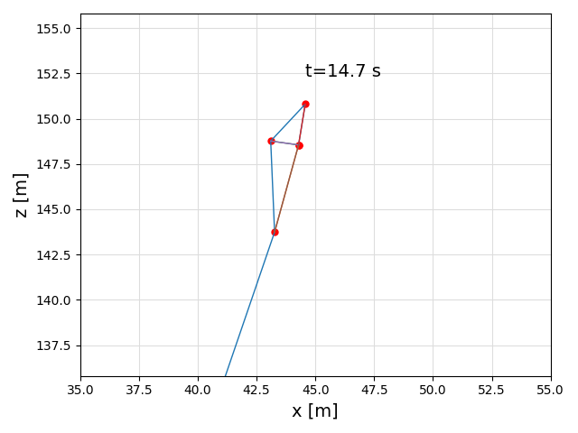

```@meta
CurrentModule = KiteModels
```
# Quickstart

## Installation of Julia
For a quick test of this program it is NOT needed to install vscode, git or bash. Just installing Julia is sufficient,
and that can be done in a few minutes. On Linux, just execute the command:
```
bash -ci "$(curl -fsSL https://raw.githubusercontent.com/abelsiqueira/jill/master/jill.sh)"
```
On Windows you can get Julia from the Windows store, or you download and install it from [https://julialang.org/downloads/](https://julialang.org/downloads/) . For Mac there are also different versions available on this download site.
You do NOT need administrator permissions to install Julia, but make sure to check the option "add to path" when installing.

## Create a test project
Launch a command prompt and create a folder with the name "test":
```bash
mkdir test
cd test
julia --project="."
```
With the last command we told julia to create a new project in the current directory.

Then we add the three required packages to our new project. By pressing the key "]"
we enter the package manager mode where we can add or delete packages.
```julia
]
add KiteUtils
add KitePodModels
add KiteModels
add Plots
st
<BACKSPACE>
```
The command "st" was not really required, but it is useful to display which versions
of the packages we have in our project. Another important package manager command
is the command "up", which updates all packages to the latest compatible versions.

Then, copy the default configuration files and examples to your new project:
```julia
using KiteModels
copy_settings()
copy_examples()
```
The first command copies the files settings.yaml and system.yaml to the folder data.
They can be customized later. The second command creates an examples folder with some examples.

Your folder structure should now look like this:
```
shell> tree
.
├── data
│   ├── settings.yaml
│   └── system.yaml
├── examples
│   ├── compare_kps3_kps4.jl
│   ├── plot2d.jl
│   └── simulate.jl
├── Manifest.toml
└── Project.toml

2 directories, 7 files
```
You can access the operating system command line by typing the character ";", you then get a "shell" prompt and can enter operating system commands. To leave shell mode, type \<BACKSLASH\>. 
On windows you need to type ```tree /f``` instead of ```tree``` to see the files.

## Executing the first example
From the Julia prompt you can use the command "include" to execute a script:
```
include("examples/simulate.jl")
```
On Windows you need to type "\\\\" instead of "/":
```
include("examples\\simulate.jl")
```
You will see the 4 point kite fly for 30s. If you want to change the settings of the simulation, open the file "simulate.jl" in your favourite text editor, modify the settings at the beginning of the file and execute the include command again.
You can use the   \<TAB\> key for autocompletion, for example ```include("ex<TAB>>``` completes to ```include("examples\``` which can save a lot of typing. If you type \<TAB\> again you get a list of files to choose from.

Try out changing the following default settings:
```
dt = 0.05
STEPS = 600
PLOT = true
FRONT_VIEW = false
ZOOM = true
PRINT = false
STATISTIC = false
```
Now you can quit julia with the command ``` exit()```. If you want to launch julia again, be sure to be in the correct folder and then type ```julia --project```. Without the parameter ```--project``` it will not load your project settings.

The first run of the script will be slow because Julia must compile the code. The second and any further run is very fast, but only as long as you do not leave your Julia session.

## Comparing the one point and the four point kite model
Start Julia in the project folder you created before:
```bash
cd test
julia --project
```
and then execute the command
```
using KiteModels
include("examples/compare_kps3_kps4.jl")
```
Use the command ```include("examples\\compare_kps3_kps4.jl")``` on Windows.

The last view of the animation should look like this:



You can save what you see with the command ```savefig("kite.png")```.

### Exercise
Modify the variable ```ALPHA_ZERO``` in line 11 of the script until the lift force of the 1 point model and the 4 point model match.

## Questions?
If you have any questions, please ask in the Julia Discourse forum in the section [modelling and simulation](https://discourse.julialang.org/c/domain/models) , or in in the section [First steps](https://discourse.julialang.org/c/first-steps) . The Julia community is very friendly and responsive.