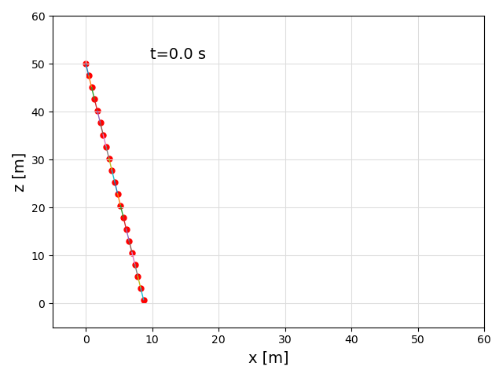
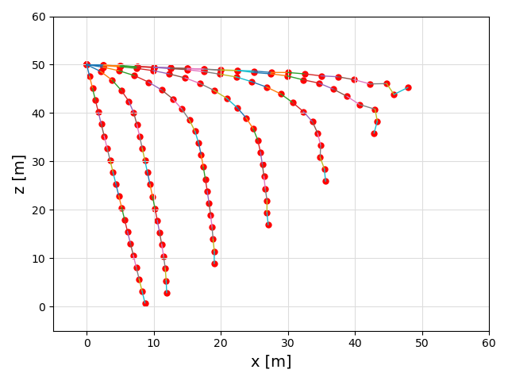

```@meta
CurrentModule = KiteModels
```
# Custom SystemStructure and SymbolicAWESystem

A custom `SystemStructure` can be used to create models of kite power systems of almost any configuration.
- custom amount of tethers
- custom bridle configurations
- quasi-static or dynamic point masses
- different amounts of stiffness, damping and diameter on different tether segments

## Precondition
First, following the [Quickstart](@ref) section up to the installation of the examples. Make sure that
at least `KiteModels` version 0.8 is installed by typing `using Pkg; Pkg.status()`. To start Julia,
either use `julia --project`, or `./bin/run_julia`.

## Creating a simple tether

We start by loading the necessary packages and defining settings and parameters.

```julia
using KiteModels, VortexStepMethod, ControlPlots

set = se("system_ram.yaml")
set.segments = 20
dynamics_type = DYNAMIC
```

Then, we define vectors of the system structure types we are going to use. For this simple example we only need points and segments.

```julia
points = Point[]
segments = Segment[]

points = push!(points, Point(1, zeros(3), STATIC; wing_idx=0))
```

The first point we add is a static point. There are four different [`DynamicsType`](@ref)s to choose from: `STATIC`, `QUASI_STATIC`, `DYNAMIC` and `WING`. `STATIC` just means that the point doesn't move. `DYNAMIC` is a point modeled with acceleration, while `QUASI_STATIC` constrains this acceleration to be zero at all times. A `WING` point is connected to a wing body.

Now we can add `DYNAMIC` points and connect them to each other with segments. `BRIDLE` segments don't need to have a tether, because they have a constant unstretched length.
```julia
segment_idxs = Int[]
for i in 1:set.segments
    global points, segments
    point_idx = i+1
    pos = [0.0, 0.0, i * set.l_tether / set.segments]
    push!(points, Point(point_idx, pos, dynamics_type; wing_idx=0))
    segment_idx = i
    push!(segments, Segment(segment_idx, (point_idx-1, point_idx), BRIDLE))
    push!(segment_idxs, segment_idx)
end
```

In order to describe the initial orientation of the structure, we define a [`Transform(idx, elevation, azimuth, heading)`](@ref) with an elevation (-80 degrees), azimuth and heading, and a base position `[0.0, 0.0, 50.0]`.
```julia
transforms = [Transform(1, deg2rad(-80), 0.0, 0.0; 
              base_pos = [0.0, 0.0, 50.0], base_point_idx=points[1].idx,
              rot_point_idx=points[end].idx)]
```

From the points, segments and transform we create a [`SystemStructure(name, set)`](@ref), which can be plotted in 2d to quickly investigate if the model is correct.
```julia
sys_struct = SystemStructure("tether", set; points, segments, transforms)
plot(sys_struct, 0.0)
```


If the system looks good, we can easily model it, by first creating a [`SymbolicAWEModel`](@ref), initializing it and stepping through time.
```julia
sam = SymbolicAWEModel(set, sys_struct)

init_sim!(sam; remake=false)
for i in 1:80
    plot(sam, i/set.sample_freq)
    next_step!(sam)
end
```


# Using a winch and a tether

Let's try to adjust the length of the tether in the last example. To do this we first need to create a set of segments with a common changing `l0`, called a [`Tether`](@ref).
```julia
tethers = [Tether(1,[segment.idx for segment in segments])]
```
As you can see, we just add all of the segments from the simple tether to our [`Tether`](@ref) struct.
The next step is to create a winch. Each winch can be connected to one or more tethers, so it is possible to connect multiple tethers to the same winch. We have to specify which kind of winch we want to use. For now, only the `TorqueControlledMachine` from `WinchModels.jl` is supported.

```julia
using WinchModels
wm = TorqueControlledMachine(set)
winches = [Winch(1, wm,[1])]
```

The 2d plot of the [`SystemStructure`](@ref) should still look the same, so we don't have to plot that. We can just create the system, and simulate it. We just need to be sure that we call plot with `t=0.0` to reset the plot.

```julia
sys_struct = SystemStructure("winch", set; points, segments, transforms)
sam = SymbolicAWEModel(set, sys_struct)
init_sim!(sam; remake=false)
for i in 1:80
    plot(sam, (i-1)/set.sample_freq)
    next_step!(sam)
end
```

# Using a pulley

First, we need to update some settings. `l_tether` is specified such that the plot window is zoomed in correctly.

```julia
using KiteModels, VortexStepMethod, ControlPlots

set = se("system_ram.yaml")
set.v_wind = 10.0
set.l_tether = 5.0
set.abs_tol = 1e-4
set.rel_tol = 1e-4
dynamics_type = DYNAMIC
```

Now we create points and segments in a similar manner as in the last example. The `mass` keyword can be used to specify the mass of the point itself. When `mass=0.0` the mass of the point just consists of the tether/segment mass.

```julia
points = Point[]
segments = Segment[]
pulleys = Pulley[]

push!(points, Point(1, [0.0, 0.0, 2.0], STATIC))
push!(points, Point(2, [2.0, 0.0, 2.0], STATIC))
push!(points, Point(3, [0.1, 0.0, 1.0], DYNAMIC))
push!(points, Point(4, [0.1, 0.0, 0.0], DYNAMIC; mass=0.1))

push!(segments, Segment(1, (3,1), BRIDLE))
push!(segments, Segment(2, (3,2), BRIDLE))
push!(segments, Segment(3, (3,4), BRIDLE))
```

Pulleys can be modeled when three or more [`Segment`](@ref)s are connected to a common [`Point`](@ref). When creating a pulley, only two segments are specified: these are the segments of the tether moving through the pulley.

```julia
push!(pulleys, Pulley(1, (1,2), DYNAMIC))
```

We can then use a [`Transform`](@ref) to describe the orientation of the initial system. 

```julia
transforms = [Transform(1, -deg2rad(0.0), 0.0, 0.0; base_pos=[1.0, 0.0, 4.0], base_point_idx=1, rot_point_idx=2)]
sys_struct = KiteModels.SystemStructure("pulley", set; points, segments, pulleys, transforms)
plot(sys_struct, 0.0; zoom=false, l_tether=set.l_tether)
```

If the plot of the [`SystemStructure`](@ref) looks good, we can continue by creating a [`SymbolicAWEModel`](@ref) and simulating through time.

```julia
sam = SymbolicAWEModel(set, sys_struct)
init_sim!(sam; remake=false)
for i in 1:100
    plot(sam, i/set.sample_freq; zoom=false)
    next_step!(sam)
end
```

# Adding a wing

Now we can finally start modeling a full kite system, with points, segments, pulleys, winches and a wing! For simplicity, we will create a kite with just one tether connected to a so-called KCU (Kite Control Unit). A KCU can be modeled as a point with extra mass and area, and with some winches connected to it.


